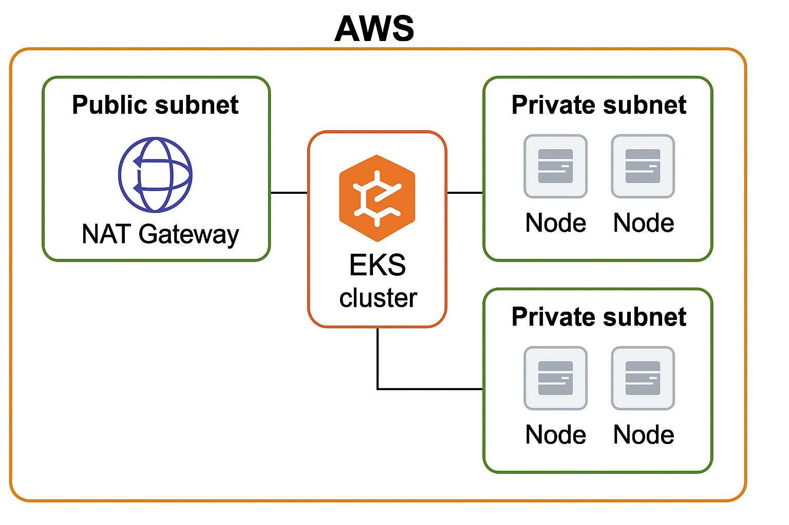

# infra-terraform

Infrastructure as Code for provisioning a complete EKS environment on AWS using **Terraform**, **Helm**, and **GitHub Actions**.

---

## Features

### ✅ EKS Cluster (eks-cluster/)
- Provisions an EKS cluster with Terraform
- Uses dynamic inputs (`region`, `cluster_name`, `k8s_version`, `ami_type`)
- Creates node groups with scaling config and lifecycle policies

### ✅ VPC & Networking (vpc.tf)
- Public & private subnets
- NAT Gateway and Internet Gateway
- Route tables and associations

### ✅ Helm-based Service Deployments (helm-updates/)
- Installs:
  - NGINX Ingress Controller
  - cert-manager
  - Argo CD
  - loki
  - Promtail
  - Kube-prometheus-stack (Grafana, Prometheus and alertmanager)
- Helm values fully templated
- TLS via cert-manager and `letsencrypt-prod`

### ✅ Bastion & Admin Setup (infra-admin/)
- Key pair generation
- SSH security group rules
- Integration with subnet and VPC lookup

---


### Architecture




---

## GitHub Actions Workflows

| File                            | Purpose                        |
|---------------------------------|--------------------------------|
| `.github/workflows/deploy-eks.yaml`     | Provisions EKS cluster         |
| `.github/workflows/deploy-helm.yaml`    | Deploys Helm-managed services |
| `.github/workflows/deploy-admin-resources.yaml` | Admin resources setup (bastion hosts, ecr repo) |

Each workflow:
- Uses `aws-actions/configure-aws-credentials` for auth
- Runs Terraform with `setup-terraform`
- Injects dynamic values using `TF_VAR_` environment variables

---

## Usage

### 1. Configure GitHub Secrets

Create these in your GitHub repo under **Settings → Secrets → Actions**:

- `AWS_ACCESS_KEY_ID`
- `AWS_SECRET_ACCESS_KEY`
- `BASIC_AUTH_USER`
- `BASIC_AUTH_PASS`


### 2. Customize Inputs

Terraform input variables are defined in `variables.tf` and can be overridden using environment variables in your CI pipeline.

Instead of hardcoding values, this project uses the `TF_VAR_<variable_name>` convention to pass inputs dynamically in GitHub Actions workflows.

#### Example

To override variables like `cluster`, `region`, or `cluster_version`, the workflow sets:

```yaml
env:
  TF_VAR_cluster: rigetti-demo
  TF_VAR_region: us-east-1
  TF_VAR_cluster_version: 1.32
```


### 3. Trigger Deployments

Push to the `main` branch or commit changes in any of the following directories:

- `eks-cluster/`
- `infra-admin/`
- `helm-updates/`

Workflows will automatically run, plan, and apply the Terraform changes.


### 4. Application URLs

Below are the key services deployed via Helm and their associated domains:

| Application      | Description                      | URL                             |
|------------------|----------------------------------|----------------------------------|
| Grafana          | Monitoring dashboard             | https://monitoring.rigettidemo.com |
| Alertmanager     | Alerting service                 | https://alertmanager.rigettidemo.com |
| Argo CD          | GitOps UI for deployments        | https://gitops.rigettidemo.com |
| ChartMuseum      | Helm chart repository            | https://charts.rigettidemo.com |
| Hash Store       | Custom app service (Go backend)  | https://hash-store.rigettidemo.com |

> ⚠️ Ensure DNS and TLS (via cert-manager) are correctly configured for all routes.


